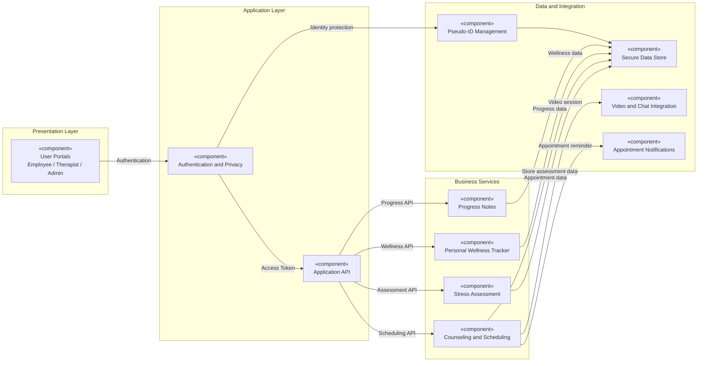

# Corporate Mental Wellness & Counseling Platform

## Layered Architecture – UML Component Diagram

```mermaid
flowchart LR

    subgraph P["Presentation Layer"]
        EMP["«component»<br/>User Portals<br/>Employee / Therapist / Admin"]
    end

    subgraph A["Application Layer"]
        AUTH["«component»<br/>Authentication and Privacy"]
        API["«component»<br/>Application API"]
    end

    subgraph B["Business Services"]
        ASSESS["«component»<br/>Stress Assessment"]
        SCHEDULE["«component»<br/>Counseling and Scheduling"]
        WELL["«component»<br/>Personal Wellness Tracker"]
        NOTES["«component»<br/>Progress Notes"]
    end

    subgraph D["Data and Integration"]
        PSEUDO["«component»<br/>Pseudo-ID Management"]
        DB["«component»<br/>Secure Data Store"]
        VIDEO["«component»<br/>Video and Chat Integration"]
        NOTIFY["«component»<br/>Appointment Notifications"]
    end

    EMP -->|Authentication| AUTH
    AUTH -->|Access Token| API

    API -->|Assessment API| ASSESS
    API -->|Scheduling API| SCHEDULE
    API -->|Wellness API| WELL
    API -->|Progress API| NOTES

    ASSESS -->|Store assessment data| DB
    SCHEDULE -->|Appointment data| DB
    WELL -->|Wellness data| DB
    NOTES -->|Progress data| DB

    AUTH -->|Identity protection| PSEUDO
    PSEUDO --> DB

    SCHEDULE -->|Video session| VIDEO
    SCHEDULE -->|Appointment reminder| NOTIFY
```
